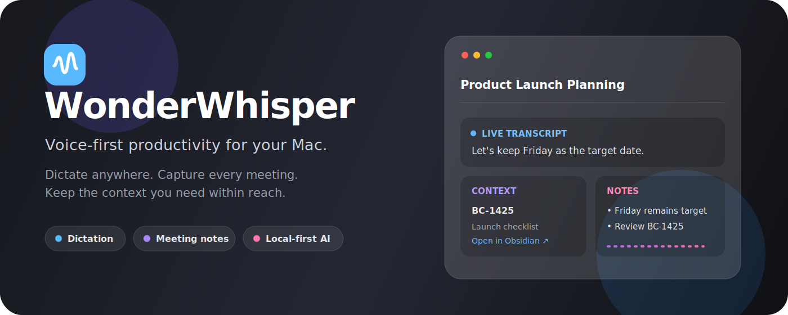
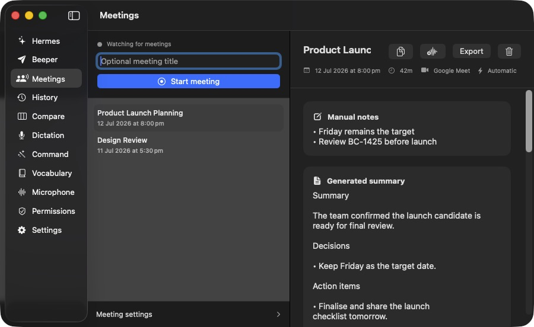

<p align="center">
  
</p>

<h1 align="center">WonderWhisper</h1>

<p align="center">
  <strong>Dictate anywhere. Capture every meeting. Keep the context you need within reach.</strong>
</p>

<p align="center">
  An open-source, voice-first productivity app for macOS.
</p>

<p align="center">
  <a href="https://github.com/dkapo88/WonderWhisper-macOS/releases/latest"></a>
  
  <a href="LICENSE"></a>
</p>



WonderWhisper brings dictation, meeting intelligence, and voice-driven workflows into one native Mac app. Its local-first path works without sending audio to a cloud service, while optional providers add faster streaming, post-processing, live context, and integrations when you want them.

## One app, three useful layers

| Dictate | Meet | Connect |
| --- | --- | --- |
| Speak into any focused text field with a global hotkey. Clean up the result, preserve your voice, or transform selected text with Command Mode. | Record microphone and Mac system audio, follow a live transcript, take manual notes, surface Obsidian context, and export a Markdown summary. | Send voice messages through Beeper or run optional long-lived tasks against a Hermes Agent server. |

Hermes is now an optional integration—not the identity of the app. WonderWhisper is designed as a broader voice workspace that remains useful even when Hermes and Beeper are never configured.

## Meeting notes

WonderWhisper can start a meeting manually or automatically when it confirms a Google Meet, Slack Huddle, or another configured calling app. During the meeting it keeps separate microphone and system-audio tracks, so headphones and output volume do not determine whether remote speakers are captured.



The meeting workflow includes:

- Durable microphone and system-audio capture in bounded local segments.
- Automatic detection with editable trigger apps and conservative start/stop confirmation.
- Free on-device transcription with Parakeet Unified by default.
- Optional Soniox V5 live transcription, including an echo-reduced mixed-stream beta and a source-separated fallback.
- A floating companion with **Transcript**, **Context**, and **Notes** tabs.
- A draggable minimized recording bubble with a live audio visualizer.
- Manual notes that save continuously and are included in the final meeting summary.
- Optional generated summaries, decisions, and action items through OpenRouter.
- Local Obsidian search with links and bounded excerpts for live context.
- Markdown export to a chosen folder inside your Obsidian vault.

Stopping a meeting ends capture immediately. Final transcript tokens, recovery, generated notes, and export continue safely in the background.

### Obsidian context and export

Meeting settings use two paths for different jobs:

- **Vault root** is searched locally for notes related to the live conversation.
- **Export folder** is where WonderWhisper writes finished meeting Markdown files; it can be any nested folder inside the vault.

Vault ranking happens on your Mac. If live AI context is enabled, only a bounded recent transcript window and bounded excerpts from the best local matches are sent to the selected OpenRouter model.

## Dictation and Command Mode

Dictation is the fastest path from speech to text:

1. Focus a text field in any Mac app.
2. Hold the Dictation hotkey and speak.
3. Release to transcribe, optionally clean up, and insert the result.

Command Mode treats speech as an instruction instead. It can work with selected text, a recently copied value, the focused text field, local screen OCR, and your custom vocabulary.

Typical commands include:

- “Make this shorter and warmer.”
- “Turn this into a launch checklist.”
- “Reply politely and ask for a timeline.”
- “Explain the selected paragraph in plain English.”

Fresh installs default Dictation to **Fn/Globe** and Command Mode to **Right Option**. Both shortcuts are configurable.

## Transcription and AI models

Transcription and language-model processing are separate choices.

| Engine | Where it runs | Best for |
| --- | --- | --- |
| **Parakeet Unified / V3** | On device | Private, free transcription; Unified is the default and V3 adds multilingual coverage. |
| **Groq Whisper Large V3 Turbo** | Cloud | Fast batch transcription through Groq. |
| **Soniox V5** | Cloud | Low-latency streaming dictation and optional live meeting transcription. |
| **OpenRouter Voice** | Cloud | Choosing supported speech-to-text models through OpenRouter. |
| **xAI Grok Speech-to-Text** | Cloud | xAI batch or streaming transcription. |

OpenRouter powers optional dictation cleanup, Command Mode, meeting summaries, and live context. Models are selected from your favourites in Settings. Reasoning can be omitted, disabled, or enabled at a small level; **Omit** offers the broadest compatibility, while **Off** should only be used with models that accept reasoning-free requests.

API credentials are stored in macOS Keychain. You only need keys for the providers and integrations you enable.

## Privacy model

WonderWhisper makes the local/cloud boundary explicit:

| Data or operation | Default behaviour | Sent elsewhere only when… |
| --- | --- | --- |
| Microphone and system audio | Captured and segmented locally | A cloud transcription engine is selected. |
| Parakeet transcription | Audio processing runs locally; audio never leaves your Mac | Resulting transcript text is included only when you enable OpenRouter cleanup, generated notes, or live context. |
| Manual notes and meeting history | Saved locally | Generated meeting notes are explicitly enabled. |
| Obsidian search and ranking | Runs locally in the chosen vault | Live AI context is enabled; only bounded matching excerpts are included. |
| Dictation text | Can remain local with Parakeet and no cleanup | OpenRouter cleanup or a cloud STT engine is enabled. |
| Beeper or Hermes content | Unused by default | You configure and invoke the relevant integration. |

Local application data is stored under `~/Library/Application Support/HermesWhisper/`. The legacy internal directory name is intentionally retained so existing users keep their meetings, history, settings, and credentials after upgrading to WonderWhisper.

## Install

WonderWhisper requires **macOS 15.5 or newer**.

1. Download the latest signed and notarized DMG from [GitHub Releases](https://github.com/dkapo88/WonderWhisper-macOS/releases/latest).
2. Drag **WonderWhisper.app** into Applications.
3. Open **Permissions** in the sidebar and grant the capabilities you use:
   - Microphone
   - Screen & System Audio Recording
   - Accessibility
   - Input Monitoring
4. Choose a transcription engine in Settings. Parakeet is the no-key, on-device default.
5. Add API keys only for optional cloud providers or integrations.

### Upgrading from HermesWhisper

Quit HermesWhisper before installing WonderWhisper. The new app deliberately retains the existing bundle identity and storage locations, so macOS permissions, UserDefaults, Keychain credentials, history, and meeting data continue to work.

Because the application filename changed, remove the old `/Applications/HermesWhisper.app` after installing WonderWhisper to avoid keeping two launchable copies.

## Optional integrations

### Beeper

WonderWhisper can send transcribed voice messages into configured Beeper chats and monitor replies through Beeper Desktop's local API. Beeper Desktop must be running with its Desktop API enabled. Chat IDs, labels, shortcuts, and response polling are configured in the Beeper sidebar tab.

### Hermes Agent

The Hermes tab connects to an OpenAI-compatible Hermes Agent `/v1` server. It supports parallel sessions, voice or typed replies, persistent local conversation history, and independent response windows. Configure the server URL, bearer token, conversation prefix, and optional agent profile under **Hermes → Settings**.

## Build from source

Requirements:

- Xcode with the macOS 15.5 SDK or newer
- A Mac capable of running macOS 15.5+

```bash
git clone https://github.com/dkapo88/WonderWhisper-macOS.git
cd WonderWhisper-macOS
open WonderWhisper.xcodeproj
```

Build from the command line:

```bash
xcodebuild \
  -project WonderWhisper.xcodeproj \
  -scheme WonderWhisper \
  -configuration Debug \
  build
```

Run the test suite:

```bash
xcodebuild \
  -project WonderWhisper.xcodeproj \
  -scheme WonderWhisper \
  -destination 'platform=macOS' \
  test
```

The project uses Swift Testing with `@Test` and `#expect`.

## Project layout

```text
WonderWhisper/          App sources, views, services, providers, and assets
WonderWhisperTests/     Unit and integration tests
WonderWhisperUITests/   macOS UI automation
Scripts/                Local build, run, and release helpers
docs/assets/            README artwork and product screenshots
```

Core orchestration lives in `DictationViewModel` and `MeetingCoordinator`. Provider protocols keep transcription and LLM services replaceable, while history, meetings, notes, and conversations use local file-backed stores.

## Troubleshooting

- **A hotkey does nothing:** verify Accessibility and Input Monitoring permissions, then check the shortcut is not claimed by another app.
- **A meeting has microphone text but no system audio:** grant Screen & System Audio Recording permission and restart WonderWhisper.
- **Automatic detection is delayed:** supported browser calls require both calling-page evidence and microphone activity; automatic starts are intentionally conservative.
- **A local model is not ready:** the first Parakeet run may need time to prepare model assets.
- **A cloud request fails with a reasoning error:** set reasoning to **Omit** or a level the selected model supports.
- **Two menu-bar icons appear after upgrading:** quit and delete the old `HermesWhisper.app` copy.

## Contributing

Issues and focused pull requests are welcome. Please keep changes scoped, include tests for provider or audio logic where practical, and confirm the macOS build and test suite pass before opening a PR. Never commit API keys or local credentials.

## License

WonderWhisper is available under the [MIT License](LICENSE).
