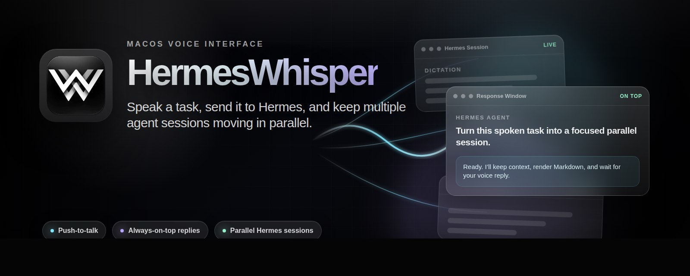

<p align="center">
  
</p>

# HermesWhisper

HermesWhisper is a macOS voice interface for dictation, command-style text
editing, and hands-free interaction with a Hermes Agent API server. It is built
around a simple workflow: press a hotkey, speak, and let the app either insert
clean text into your current app or send the request to Hermes as an agent task.

The app is useful for:

- Fast push-to-talk dictation into any focused text field.
- LLM cleanup of raw speech into readable text, emails, notes, lists, or chat
  messages.
- Voice-driven editing and writing commands using selected text, clipboard text,
  the active text field, and OCR screen context.
- Parallel Hermes Agent sessions with response windows that stay available while
  you continue working.
- Persistent local history for normal dictation, command turns, and Hermes chats.

## App Overview

HermesWhisper has three main modes:

| Mode | Purpose | Typical use |
| --- | --- | --- |
| Dictation | Turn speech into cleaned-up text and insert it into the active app. | Compose Slack messages, emails, notes, issue comments, or documents. |
| Command Mode | Treat your speech as an instruction for transforming or creating text. | "Make this shorter", "turn this into bullets", "reply politely", or "write a launch checklist". |
| Hermes | Send spoken or typed tasks to a Hermes Agent server. | Delegate research, coding, planning, file work, or longer-running agent tasks. |

The app is intentionally voice-first, but it also supports text replies in the
Hermes chat UI and response windows when talking is not convenient.

## Models and AI Providers

HermesWhisper separates transcription from language-model post-processing.

### Transcription Engines

You can choose the transcription engine in **Settings -> Transcription engine**:

- **Parakeet V3 (On-device)**: local speech-to-text on your Mac. No cloud API key
  required.
- **Groq Whisper Turbo (Cloud)**: Groq-hosted Whisper Large V3 Turbo.
- **Soniox V4 (Real-time Cloud)**: streaming speech-to-text with live preview.
- **OpenRouter Voice (Cloud)**: OpenRouter speech-to-text models such as
  `openai/gpt-4o-mini-transcribe`.
- **Grok STT / xAI (Cloud)**: xAI speech-to-text endpoint.

### LLM Post-Processing

Normal dictation and Command Mode use OpenRouter for LLM cleanup and command
execution. The app stores OpenRouter favourites locally and defaults to a small
set of practical models. OpenRouter reasoning is disabled by default for
post-processing requests so cleanup stays fast and literal.

LLM post-processing can:

- Remove filler words.
- Add punctuation and paragraph breaks.
- Preserve your speaking style.
- Convert spoken symbols and numbers.
- Apply vocabulary and screen-context spelling hints.
- Transform selected or copied text in Command Mode.

### API Keys

API keys are stored in macOS Keychain from inside the app. Only configure keys
for providers you actually use.

| Provider | Used for | Where to get a key |
| --- | --- | --- |
| OpenRouter | LLM post-processing and optional OpenRouter Voice STT. | [OpenRouter API keys](https://openrouter.ai/docs/api-keys) |
| Groq | Groq Whisper cloud transcription. | [GroqCloud API keys](https://console.groq.com/keys) |
| Soniox | Soniox real-time transcription. | [Soniox Console](https://console.soniox.com) |
| xAI | Grok speech-to-text. | [xAI Console API keys](https://docs.x.ai/developers/quickstart) |
| Hermes Agent | Remote/local Hermes `/v1` API bearer token. | Your Hermes Agent server configuration. See [Hermes Agent docs](https://hermes-agent.nousresearch.com/docs/reference/faq) and [GitHub repo](https://github.com/NousResearch/hermes-agent). |

## Normal Dictation

Normal dictation is for inserting cleaned-up text into the app you are already
using.

1. Click into any text field.
2. Press and hold the Dictation hotkey.
3. Speak naturally.
4. Release the hotkey.
5. HermesWhisper transcribes, optionally post-processes, and inserts the result.

Fresh installs default the Dictation hotkey to **Fn/Globe**.

Dictation is best when you want the final output to be your spoken text, cleaned
up but not answered. For example, if you dictate "what do you think about moving
the meeting", normal dictation should insert a cleaned-up version of that
sentence, not answer the question.

## Command Mode

Command Mode treats your speech as an instruction. It can transform existing
text or generate new content.

Fresh installs default Command Mode to **Right Option**.

### With Selected Text

Highlight text in another app, press the Command Mode hotkey, and speak an
instruction:

- "Make this more concise."
- "Turn this into bullet points."
- "Rewrite this in a warmer tone."
- "Extract the action items."
- "Convert this into a Slack message."
- "Explain this in plain English."

When selected text is available and selected-text context is enabled, the app
sends it to the model as `<SELECTED_TEXT>`.

### With Clipboard Text

If clipboard context is enabled, recently copied text can be used as source
material. This is useful when the app cannot read selected text directly, or when
you copy a link and want the command to reference it.

Clipboard context is intentionally recent. For normal Dictation and Command Mode,
the app only uses text copied shortly before recording starts. Hermes Mode has a
separate configurable copied-text timeout, described below.

### Without Selected Text

Command Mode also works without selected text. In that case, your speech becomes
the task:

- "Write a short follow-up email asking for the timeline."
- "Give me three options for a product update title."
- "What is the difference between HTTP/1.1 and HTTP/2?"
- "Draft a checklist for releasing a macOS app."

If there is no selected text or clipboard target, Command Mode uses the spoken
instruction directly.

## Screen Context

Screen context lets the app use what you are looking at as reference material.
It is designed to improve spelling, formatting, and editing accuracy without you
having to describe every detail aloud.

Depending on the mode and settings, HermesWhisper can include:

- **Active application**: the app you are dictating into.
- **Screen OCR terms**: local OCR from the active window or display.
- **Selected text**: highlighted text from the active app when available.
- **Active text field**: the full focused text field when nothing is selected.
- **Clipboard text**: recent copied text, if enabled.
- **Screenshot image**: optional for Hermes requests.
- **Vocabulary**: custom names, product terms, acronyms, and spellings.

Example workflows:

- Highlight a paragraph and say, "Make this shorter and more direct."
- Highlight a support reply and say, "Make this warmer but keep it concise."
- Copy a Linear or Jira link and say, "Write a message to the team about this."
- Open a page with product names visible and dictate a message that includes
  those names. Screen context helps the formatter spell them correctly.
- Use Command Mode without selecting anything and ask for a short explanation or
  draft.

Screen context is reference material. It should guide spelling and formatting,
not secretly change what you asked for.

## Hermes Mode

Hermes Mode connects HermesWhisper to a local or remote Hermes Agent API server.
It is for agent work that may take longer than a dictation cleanup turn.

Examples:

- "Research the latest options and summarize the trade-offs."
- "Create a roadmap for this feature."
- "Inspect the project and tell me what changed."
- "Run this task on my VPS and report back."

Fresh installs default the Hermes hotkey to **Backslash (`\\`)**.

### Hermes Setup

1. Install and configure Hermes Agent.
2. Start a Hermes API server that exposes an OpenAI-compatible `/v1` endpoint.
3. Open HermesWhisper.
4. Go to **Hermes -> Settings**.
5. Enter:
   - **URL**: your Hermes API base URL, often ending in `/v1`.
   - **API key**: bearer token for the Hermes API server, if required.
   - **Conversation prefix**: a short name used for HermesWhisper-created
     sessions.
   - **Agent profile**: optional profile/model name advertised by `/v1/models`.
6. Click **Test**.

The Hermes settings page includes a copyable setup prompt. Give that prompt to
Hermes if you want the agent to tell you the exact URL, API key source,
conversation prefix, and profile value to enter.

If **Agent profile** is blank, HermesWhisper uses the server default. If it is
filled in, HermesWhisper sends that value as the API `model` and verifies it
against `/v1/models` during connection testing.

### Parallel Sessions

HermesWhisper supports multiple Hermes tasks at the same time.

- If no Hermes response window is open and you press the Hermes hotkey, the app
  starts a new Hermes session.
- If a Hermes response window is open and focused, pressing the Hermes hotkey
  records a reply to that session.
- If multiple response windows are open, the top/focused response window is the
  reply target.
- Each session keeps its own conversation state.
- Each response window can be replied to, minimized, copied from, archived, or
  closed independently.

This lets you delegate several tasks in parallel without forcing them into one
long conversation.

### Response Modalities

You can interact with Hermes in three ways:

- **Voice reply**: click Reply or press the Hermes hotkey while a response window
  is focused.
- **Text reply**: type directly in the response window or the Hermes chat tab.
- **Chat UI**: open the Hermes sidebar tab to review sessions, switch between
  active/archive views, continue a session, or inspect history.

Response windows are immediate and disposable; the Hermes tab is the persistent
place to review and manage session history.

### Timeouts

Hermes request timeout controls how long HermesWhisper waits for the API server
to return a response. Fresh installs default to **20 minutes**, and the app
supports values up to **30 minutes**.

Use a longer timeout when Hermes is doing slow coding, research, or remote
terminal work. Use a shorter timeout if you want failed network calls to return
quickly.

Hermes copied-text timeout controls how long copied text remains eligible as
Hermes context. If the timeout is 20 seconds, copied text is only eligible when
you start the Hermes recording within 20 seconds of copying it. The timer is
checked when recording starts, not when the recording finishes. A shorter timeout
reduces the chance of accidentally sending stale clipboard data.

## Prompt Customization

The Dictation and Command sidebar pages let you customize:

- Activation hotkey.
- Whether screen context, clipboard, selected text, and active field text are
  included.
- Prompt header.
- Prompt rules.
- Prompt footer.

The app builds structured prompts for the LLM. You normally do not need to type
these XML tags yourself, but understanding them helps when customizing prompts.

| Tag | Meaning |
| --- | --- |
| `<INPUT>` | The primary input for the model. |
| `<TRANSCRIPT>` | What you said during the recording. |
| `<CONTEXT type="reference-only">` | Extra reference material, not the main instruction. |
| `<ACTIVE_APPLICATION>` | The app you were using. |
| `<ACTIVE_TEXT_FIELD>` | The current text field contents, when available. |
| `<SELECTED_TEXT>` | Highlighted text from the active app. |
| `<SCREEN_CONTEXT_TERMS>` | Locally extracted OCR terms from the screen. |
| `<SCREEN_CONTENTS>` | Rawer OCR screen text when term extraction is not available. |
| `<CLIPBOARD>` | Recently copied text, if enabled and within timeout. |
| `<VOCABULARY>` | Your custom spelling and terminology list. |
| `<OUTPUT>` | The only content the model should return for insertion. |

Dictation prompts should preserve your spoken meaning and avoid answering
questions. Command prompts can answer, transform, or create content based on the
spoken instruction and available context.

## Menu Bar

The menu bar item provides quick access to:

- Toggle dictation.
- Add clipboard text to the vocabulary.
- Select the microphone input device.
- Select the voice/transcription engine.
- Select or type an OpenRouter voice model.

When Hermes requests are pending, the menu bar icon shows the number of pending
responses. The count drops as responses arrive and returns to the normal icon
when no Hermes requests are waiting.

## Local Data and Privacy

HermesWhisper stores local history, screenshots, audio references, and Hermes
chat state in:

```text
~/Library/Application Support/HermesWhisper/
```

API keys are stored in macOS Keychain.

After the rename from WonderWhisper, first launch copies existing local data
from:

```text
~/Library/Application Support/WonderWhisper/
```

Context features can send screenshots, OCR text, selected text, active field
text, and clipboard text to the cloud providers or Hermes server you configure.
Review the context toggles for each mode before using the app with sensitive
material.

## Build

Open the project in Xcode:

```bash
open "HermesWhisper.xcodeproj"
```

Build from the command line:

```bash
xcodebuild -project "HermesWhisper.xcodeproj" -scheme "HermesWhisper" -configuration Debug build
```

Or use the helper scripts:

```bash
./Scripts/build.sh
./Scripts/run.sh
```

## Tests

Run the Swift Testing suite from Xcode, or from the command line:

```bash
xcodebuild -project "HermesWhisper.xcodeproj" -scheme "HermesWhisper" -destination 'platform=macOS' test
```

## Troubleshooting

### Hermes Connection Fails

- Confirm the URL is reachable from your Mac.
- If using plain `http://`, make sure you are using a build that includes the
  local HTTP transport support.
- Confirm whether the server expects the root URL or `/v1`.
- Save the Hermes bearer key in settings if the server requires auth.
- Click **Test** and check whether the requested Agent profile is advertised by
  `/v1/models`.

### Dictation Does Not Insert Text

- Click into the target text field before recording.
- Check microphone permissions in macOS Privacy & Security settings.
- Confirm the chosen transcription provider has a saved API key, unless using
  Parakeet local.
- Try the History tab to verify whether transcription succeeded but insertion
  failed.

### Command Mode Uses the Wrong Context

- Check whether clipboard context is enabled and still within its timeout.
- If selected text should be used, enable selected-text context for Command Mode.
- If the app cannot read selected text from the target app, copy the text first
  and use clipboard context instead.
- Disable active field context if you only want explicit selected or copied text.

## Security

Do not commit API keys, local `.xcconfig` secrets, build outputs, result bundles,
or local assistant/editor state. Provider credentials belong in macOS Keychain
through the app settings.

## License

HermesWhisper is available under the MIT License. See [LICENSE](LICENSE).
