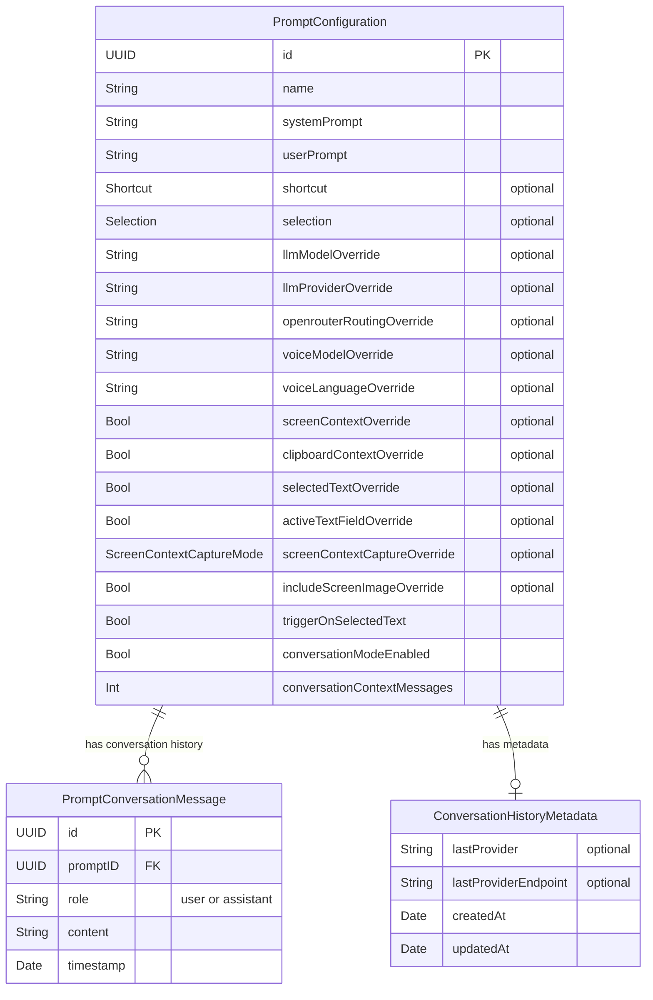
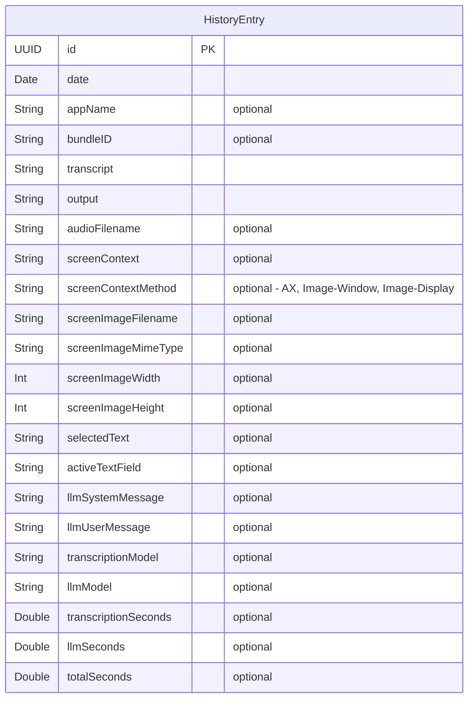
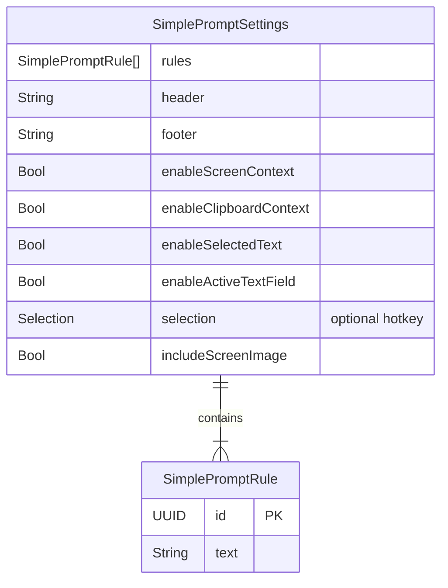
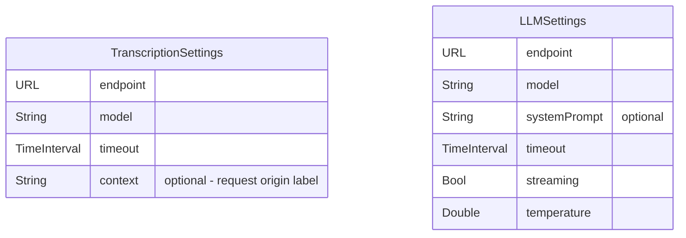
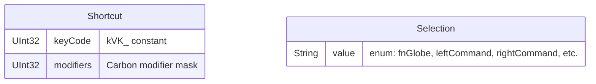
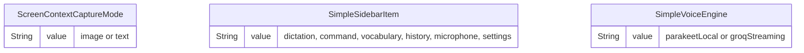
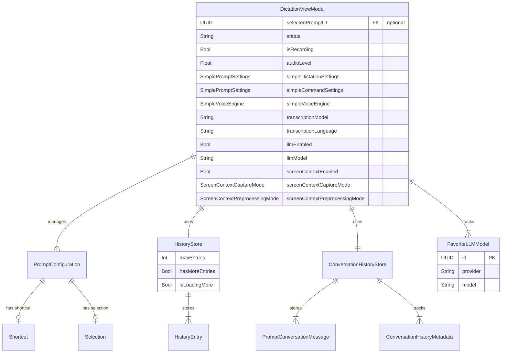
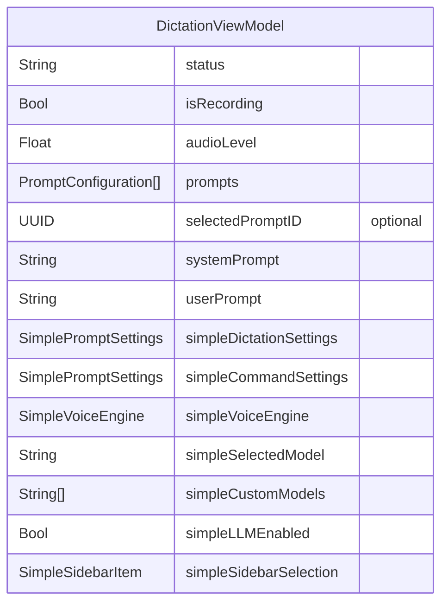
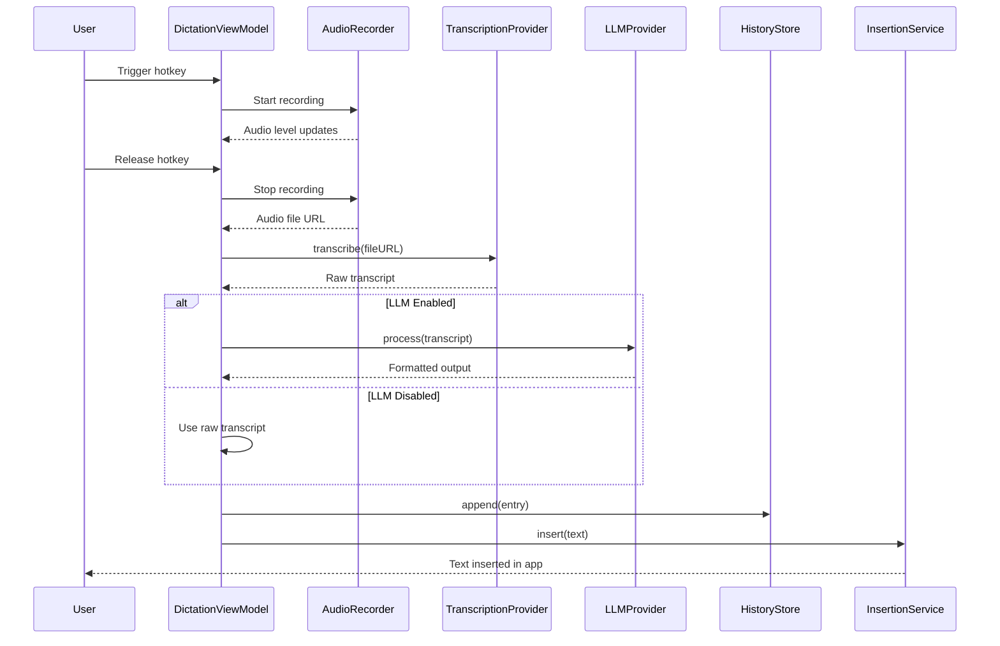
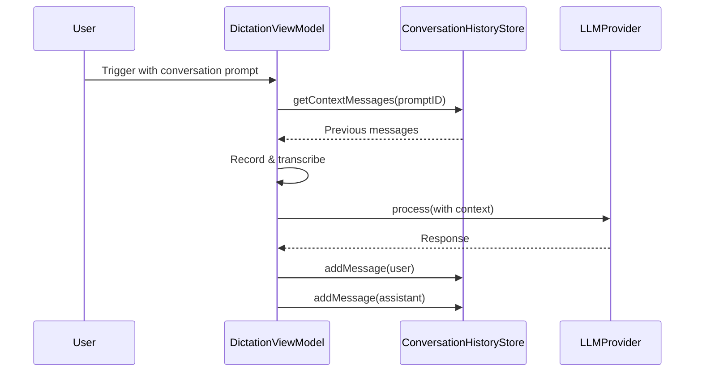

# WonderWhisper Mac - Data Model Documentation

Note to agents and contributors: Keep this document up to date with any changes.

## Overview

WonderWhisper Mac is a voice dictation and AI assistant application. This document provides comprehensive entity relationship diagrams and data model documentation for database schemas, service models, and UI data structures.

---

## Table of Contents

1. [Core Domain Models](#core-domain-models)
2. [Entity Relationship Diagrams](#entity-relationship-diagrams)
3. [Storage & Persistence](#storage--persistence)
4. [Service Models](#service-models)
5. [UI State Models](#ui-state-models)
6. [Configuration Models](#configuration-models)
7. [Maintenance](#maintenance)

---

## Core Domain Models

### 1. Prompt & Configuration System



**PromptConfiguration**: User-defined prompt templates that control how voice transcriptions are processed and formatted. Each prompt can have:
- Custom system/user prompts
- LLM/voice model overrides
- Context capture settings
- Hotkey bindings
- Conversation mode settings

**PromptConversationMessage**: Messages in conversation history for prompts with conversation mode enabled. Stores the dialogue context between user and assistant.

**ConversationHistoryMetadata**: Tracks provider information and timestamps for conversation sessions. Metadata is stored one file per prompt (filenames keyed by `promptID`).

---

### 2. Transcription History System



**HistoryEntry**: Records of completed dictation sessions. Each entry captures:
- Raw transcription and processed output
- Application context (where dictation occurred)
- Audio recording reference
- Screen context and captures
- Focused text field contents
- Performance metrics
- LLM prompts used (for transparency)

**Storage**: Files persisted in `~/Library/Application Support/WonderWhisper/History/`
- `entries/` - JSON files (one per entry)
- `audio/` - M4A/WAV recordings
- `images/` - PNG/JPG screen captures

---

### 3. Simple Mode System



**SimplePromptSettings**: Simplified configuration for the two user-facing modes. Each mode can independently toggle OCR screen context, clipboard history, selected text, and the full active text field payload.
- **Dictation**: Voice-to-text formatting
- **Command**: Selected-text/OCR aware assistant mode

**SimplePromptRule**: Individual formatting/behavior rules as plain text statements

**SimpleVoiceEngine**: User-facing toggle that selects the transcription backend.

| Case | Description | Underlying Model |
|------|-------------|------------------|
| `parakeet-local` | On-device Parakeet V3 for maximum privacy/latency | `parakeet-local` |
| `groq-streaming` | Groq Whisper Large V3 Turbo over HTTPS chunks | `whisper-large-v3-turbo` (via Groq) |

---

## Service Models

### Provider Settings



**TranscriptionSettings**: Configuration for speech-to-text providers (Parakeet V3 local capture + Groq Whisper Turbo streaming)

**LLMSettings**: Configuration for language model providers (OpenRouter only; legacy Cerebras keychain support remains)

---

### Hotkey & Input System



**Shortcut**: Key combination (e.g., Cmd+V) using Carbon API constants

**Selection**: Single modifier key for push-to-talk/toggle recording:
- `.fnGlobe` - Fn/Globe key
- `.leftCommand` - Left ⌘
- `.rightCommand` - Right ⌘
- `.leftOption` - Left ⌥
- `.rightOption` - Right ⌥
- `.control` - Either Control key
- `.commandRightShift` - ⌘ + Right Shift
- `.optionRightShift` - ⌥ + Right Shift
- `.f5` - F5 function key

---

### Mode & Enums



---

## Entity Relationship Diagrams

### Complete System Overview



---

## Storage & Persistence

### File System Layout

```
~/Library/Application Support/WonderWhisper/
├── History/
│   ├── entries/           # JSON files (HistoryEntry)
│   │   ├── <uuid>.json
│   │   └── ...
│   ├── audio/             # M4A/WAV recordings
│   │   ├── <uuid>.m4a
│   │   └── ...
│   └── images/            # PNG/JPG screen captures
│       ├── <uuid>.png
│       └── ...
└── ConversationHistory/
    └── conversations/
        ├── <promptID>_messages.json    # PromptConversationMessage[]
        └── <promptID>_metadata.json    # ConversationHistoryMetadata
```

### UserDefaults Keys

| Key | Type | Description |
|-----|------|-------------|
| `prompts.library` | Data | JSON-encoded `[PromptConfiguration]` |
| `prompts.selected.id` | String | UUID of selected prompt |
| `transcription.model` | String | Active transcription model |
| `transcription.language` | String | Transcription language code |
| `transcription.timeout` | Double | Network timeout (seconds) |
| `llm.enabled` | Bool | LLM processing enabled |
| `llm.model` | String | Active LLM model |
| `llm.streaming` | Bool | Streaming mode enabled |
| `llm.temperature` | Double | LLM temperature (0.0-1.0) |
| `llm.systemPrompt` | String | Last-selected system prompt text |
| `llm.userMessage` | String | Last-selected user prompt text |
| `llm.openrouter.routing` | String | OpenRouter routing priority (auto/latency/throughput) |
| `screenContext.enabled` | Bool | Screen context capture enabled |
| `screenContext.captureMode` | String | Capture mode (image/text) |
| `screenContext.preprocessMode` | String | Preprocessing mode |
| `screenContext.organizePrompt` | String | Organization prompt |
| `clipboardContext.enabled` | Bool | Clipboard context enabled |
| `vocab.custom` | String | Custom vocabulary list |
| `vocab.spelling` | String | Text replacement rules |
| `audio.input.uid` | String | Selected microphone UID |
| `hotkey.selection` | String | Hotkey selection mode |
| `pasteShortcut.keyCode` | Int | Paste shortcut key code |
| `pasteShortcut.modifiers` | Int | Paste shortcut modifiers |
| `insertion.useAX` | Bool | Use accessibility API for insertion |
| `insertion.pasteFormatted` | Bool | Paste as formatted text |
| `audio.preprocess.enabled` | Bool | Audio preprocessing enabled |
| `audio.voiceProcessing.enabled` | Bool | Voice processing enabled |
| `history.maxEntries` | Int | Maximum history entries to keep |
| `simple.llm.enabled` | Bool | LLM enabled in simple mode |
| `simple.model.selected` | String | Selected OpenRouter model |
| `simple.model.custom` | Array<String> | Custom OpenRouter model IDs |
| `simple.voice.engine` | String | Selected transcription engine (`parakeet-local` or `groq-streaming`) |
| `simple.dictation.settings` | Data | Dictation prompt settings |
| `simple.command.settings` | Data | Command prompt settings |
| `simple.sidebar.selection` | String | Selected sidebar item |
| `audio.stream.eq.enabled` | Bool | Stream EQ enabled |
| `audio.stream.dynamics.enabled` | Bool | Stream dynamics enabled |
| `audio.stream.chunkMs` | Int | Stream chunk size (ms) |
| `network.http_protocol_preference` | String | HTTP protocol preference |

### Keychain Storage

Secure storage via `KeychainService` for API keys:

| Key Alias | Purpose |
|-----------|---------|
| `GROQ_API_KEY` | Groq API authentication (Whisper Turbo) |
| `OPENROUTER_API_KEY` | OpenRouter API authentication |

---

## UI State Models

### View Models



---

## Configuration Models

### Application Configuration

```swift
struct AppConfig {
    // API Endpoints
    static let groqAudioTranscriptions: URL
    static let groqChatCompletions: URL
    static let openrouterChatCompletions: URL
    static let openrouterModels: URL
    
    // Default Models
    static let defaultTranscriptionModel: String = "whisper-large-v3-turbo"
    static let defaultLLMModel: String = "moonshotai/kimi-k2-instruct"
    
    // Default Prompts
    static let defaultSystemPromptTemplate: String
    static let defaultDictationPrompt: String
    static let defaultScreenOrganizePrompt: String
    
    // Keychain Aliases (active)
    static let groqAPIKeyAlias: String = "GROQ_API_KEY"
    static let openrouterAPIKeyAlias: String = "OPENROUTER_API_KEY"
    
    // Network
    static let httpProtocolPreference: HTTPProtocolPreference
}
```

---

## Maintenance

- Update this document whenever you change entities, fields, relationships, storage locations, configuration keys, or persistence formats.
- Record notable breaking changes inline near the affected section.
- After updates: adjust migrations (if applicable), update tests, and verify any storage paths referenced in code and in AGENTS.md.

### Changelog

- **v1.1 (Nov 14, 2025)**: Removed non-existent `ScreenContextPreprocessingMode`, added vocabulary & microphone to `SimpleSidebarItem`, clarified legacy keychain aliases, updated LLM provider documentation to reflect OpenRouter-only architecture.

### Simple Mode Defaults

```swift
enum SimpleModeDefaults {
    static let defaultModelID = "moonshotai/kimi-k2-0905"
    
    // Predefined model options
    static let modelOptions: [SimpleModelOption] = [
        // Moonshot, Meta LLaMA, OpenAI, Google Gemini, Anthropic Claude, Mistral
    ]
    
    // Default rules for dictation mode (17 rules)
    // Default rules for command mode (16 rules)
}
```

---

## Data Flow Diagrams

### Dictation Flow



### Conversation Mode Flow



---

## Key Design Patterns

### 1. Provider Cache Pattern
- `DictationViewModel` maintains provider caches to avoid recreating HTTP clients
- Providers are keyed by configuration signature and keyed separately for streaming/file modes
- Cache invalidation on settings change

### 2. Debounced Updates
- Provider updates debounced (500ms) to prevent excessive recreation
- Navigation should not trigger provider updates (performance optimization)

### 3. File-Based Persistence
- History entries stored as individual JSON files
- Paginated loading (20 entries at a time)
- Background queue for I/O operations

### 4. Conversation History Isolation
- Each prompt maintains separate conversation history
- Provider changes clear history automatically
- Configurable context window (message count)

### 5. Simple/Pro Mode Abstraction
- Simple mode generates `PromptConfiguration` internally
- Settings persisted separately but rendered as prompts
- Seamless switching preserves pro settings

---

## Migration Notes

### Legacy Compatibility

- `organizeScreenContextOverride` (Bool) field removed; legacy key ignored during decoding
- `shortcut` field in `SimplePromptSettings` ignored during decoding (simple mode uses `selection` only)
- Conversation history tracks provider changes to handle model switches
- Legacy Cerebras, Ollama, AssemblyAI, Soniox keychain aliases preserved but unused in shipping build

---

## Performance Considerations

### History Store
- **Pagination**: Load 20 entries at a time to avoid blocking UI
- **Background I/O**: All file operations on background queue
- **Lazy metadata**: File dates fetched only when needed

### Provider Management
- **Cache warmth**: HTTP connections pre-warmed on init
- **Debouncing**: 500ms debounce on settings changes
- **Lazy initialization**: Providers created only when needed

### Conversation History
- **Bounded context**: Limit to N most recent messages
- **Auto-cleanup**: Clear on provider/model change
- **Async writes**: All I/O operations asynchronous

---

## Security & Privacy

### API Key Management
- All API keys stored in macOS Keychain
- Never persisted to UserDefaults or JSON
- Retrieved on-demand via `KeychainService`

### Audio & Screen Captures
- Stored locally in Application Support directory
- No cloud sync or external transmission
- User controls retention via `maxEntries` setting

### Prompt Library
- User-created prompts stored locally
- System prompts embedded in app bundle
- No telemetry or external sharing

---

## Future Considerations

### Potential Schema Extensions

1. **Tags/Categories for Prompts**
   - Add `tags: [String]` to `PromptConfiguration`
   - Enable filtering and organization

2. **Multi-Language Vocabulary**
   - Extend vocabulary storage per language
   - Support language-specific custom dictionaries

3. **Prompt Sharing/Import**
   - Export prompt as JSON
   - Import community-created prompts

4. **Advanced History Filtering**
   - Filter by app, model, date range
   - Full-text search across transcripts

5. **Cloud Sync (Optional)**
   - CloudKit integration for prompt library
   - End-to-end encrypted conversation history

---

## API Contract Summary

### Core Protocols

```swift
protocol TranscriptionProvider {
    func transcribe(fileURL: URL, settings: TranscriptionSettings) async throws -> String
}

protocol LLMProvider {
    func process(text: String, userPrompt: String, settings: LLMSettings) async throws -> String
}
```

### Provider Implementations

- **TranscriptionProvider**:
  - `GroqTranscriptionProvider` (Groq Whisper API - batch)
  - `GroqStreamingProvider` (Groq chunked streaming)
  - `ParakeetTranscriptionProvider` (local V3 on-device)

- **LLMProvider**:
  - `OpenRouterLLMProvider` (OpenRouter multiplexed models)

---

## Glossary

| Term | Definition |
|------|------------|
| **Prompt Configuration** | Template defining how voice input is processed and formatted |
| **Conversation Mode** | Stateful interaction maintaining context across multiple dictations |
| **Screen Context** | Information about active application and on-screen content |
| **Simple Mode** | Primary UI with Dictate and Command presets |
| **Push-to-Talk** | Hold hotkey to record, release to process |
| **Toggle Mode** | Tap hotkey to start/stop recording |
| **Provider** | External or local service for transcription or LLM processing |

---

**Document Version**: 1.2  
**Last Updated**: November 20, 2025  
**Maintainer**: WonderWhisper Mac Development Team
