# WonderWhisper - Data Model Documentation

Note to agents and contributors: Keep this document up to date with any changes.

## Overview

WonderWhisper is a voice dictation and AI assistant application. This document provides comprehensive entity relationship diagrams and data model documentation for database schemas, service models, and UI data structures.

Local storage remains under `~/Library/Application Support/HermesWhisper/`. The WonderWhisper
rebrand intentionally retains the Hermes-era bundle identifier, UserDefaults domain, Keychain
service, and storage root so existing history, meetings, settings, credentials, and macOS privacy
grants continue to work without a large or destructive migration.

---

## Table of Contents

1. [Core Domain Models](#core-domain-models)
2. [Entity Relationship Diagrams](#entity-relationship-diagrams)
3. [Storage & Persistence](#storage--persistence)
4. [Service Models](#service-models)
5. [UI State Models](#ui-state-models)
6. [Configuration Models](#configuration-models)
7. [Maintenance](#maintenance)

---

## Core Domain Models

### 1. Prompt & Configuration System

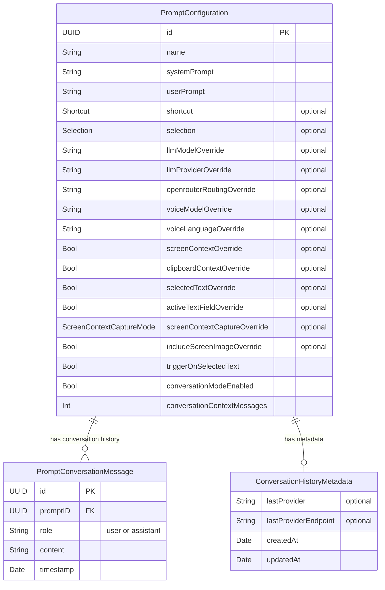

**PromptConfiguration**: User-defined prompt templates that control how voice transcriptions are processed and formatted. Each prompt can have:
- Custom system/user prompts
- LLM/voice model overrides
- Context capture settings
- Hotkey bindings
- Conversation mode settings

**PromptConversationMessage**: Messages in conversation history for prompts with conversation mode enabled. Stores the dialogue context between user and assistant.

**ConversationHistoryMetadata**: Tracks provider information and timestamps for conversation sessions. Metadata is stored one file per prompt (filenames keyed by `promptID`).

---

### 2. Transcription History System

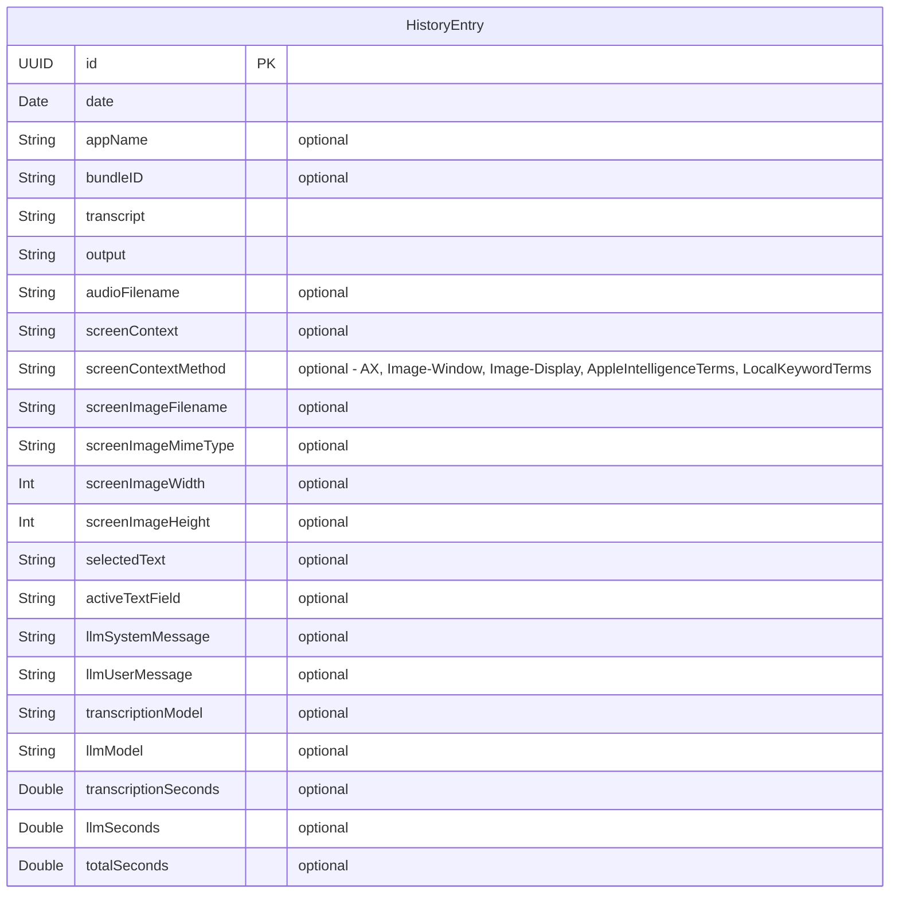

**HistoryEntry**: Records of completed dictation sessions. Each entry captures:
- Raw transcription and processed output
- Application context (where dictation occurred)
- Audio recording reference
- Screen context and captures. Text context may be raw OCR or a comma-delimited term list generated from full-display OCR.
- Focused text field contents
- Performance metrics
- LLM prompts used (for transparency)

**Storage**: Files persisted in `~/Library/Application Support/HermesWhisper/History/`
- `entries/` - JSON files (one per entry)
- `audio/` - M4A/WAV recordings
- `images/` - PNG/JPG screen captures

---

### 3. Hermes Persistent Chat System

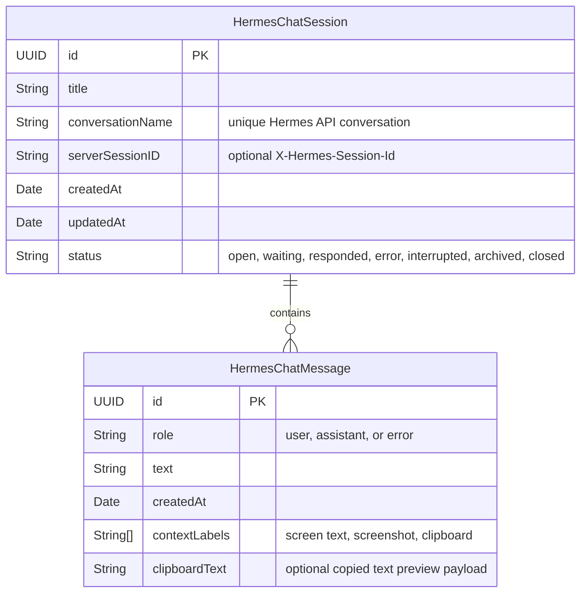

**HermesChatSession**: Persistent Hermes task thread. Each session owns a unique API `conversation` value derived from the configured Hermes conversation prefix plus the session id, allowing simultaneous background Hermes tasks to continue independently.
New sessions start with the generic title `New Hermes Task`; after the first user
turn is captured, the app asks the configured OpenRouter LLM model for a concise
local title and updates only the matching session id. Title generation is local to
WonderWhisper state and is not sent through Hermes.

**HermesChatMessage**: Messages shown in the selected Hermes sidebar Chat session. Messages are appended from the dedicated Hermes voice loop:
- User messages show the spoken transcript after optional Hermes LLM post-processing, not the enriched payload sent to the API.
- Typed user replies can also be sent from the Hermes Chat tab or a response window
  without starting audio recording. Typed replies are sent as entered and are
  stored in the same session history.
- Assistant messages show the Hermes response with Markdown rendering.
- Error messages preserve failed transcription or API turn feedback.
- Context labels indicate which optional payloads were sent with the user turn.
- User messages that include clipboard context persist the normalized clipboard text
  so the Chat UI can reveal the exact copied text from the Clipboard tag on demand.
  Legacy messages may have the label without the preview payload.
- Clipboard context is eligible only when the copied text was captured within
  the configured Hermes clipboard timeout before the Hermes recording starts.
  The default is 60 seconds and can be adjusted from 1 to 600 seconds. The
  request may finish later; the recording start time determines whether copied
  text is included.
- `hermes.postProcessing.enabled` controls whether Hermes dictation text is cleaned
  through the existing OpenRouter post-processing/vocabulary flow before it is sent
  to the Hermes API. When disabled, the raw transcript is sent.

**Persistence**: `HermesSessionStore` persists recent Hermes sessions in `~/Library/Application Support/HermesWhisper/HermesChat/sessions.json`. The default retention limit is 25 sessions, controlled by `hermes.sessions.maxSessions`; each session keeps the latest 50 messages by default, controlled by `hermes.chat.maxMessages`. `messages.json` from the previous flat chat history format is migrated into a `Previous Hermes Chat` session when `sessions.json` does not exist. Completed Hermes turns also write to the general `HistoryEntry` store with transcript, output, screen context, screenshot metadata, and LLM message payloads.

Persisted sessions found in `waiting` state after app launch are recovered as `interrupted`,
because the remote Hermes task may have continued after the local app process was restarted.
Interrupted sessions remain replyable so the user can reinitiate the same Hermes conversation.

Hermes sessions have an Active/Archive lifecycle in the app UI. Archiving removes a
session from the active list but keeps the local session record and message history
available in the Archive tab; legacy `closed` sessions are treated as archived.
Restoring an archived session returns it to a replyable active state inferred from its
latest message. Deleting a session permanently removes only the local WonderWhisper
record; it does not delete remote Hermes VPS context unless the API later adds a
separate remote delete operation.

---

### 4. Meeting Notes System

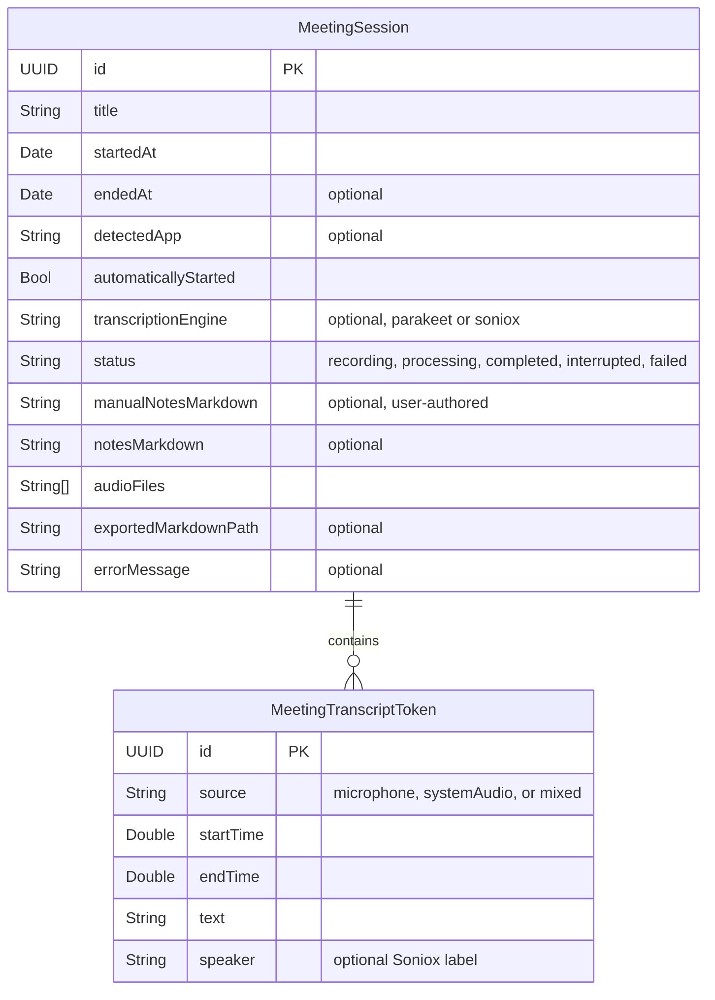

**MeetingSession**: One manually or automatically captured meeting. The manifest is saved
throughout recording so an app restart can recover an unfinished session as `interrupted`.
System and microphone audio are kept as separate one-minute, 16 kHz mono CAF segments. A private
Core Audio process tap captures system audio before output volume and device routing; manual meetings
use a global tap excluding WonderWhisper, while automatic meetings include only matching meeting-app
audio processes. ScreenCaptureKit captures the selected microphone. Parakeet Unified is the on-device
default and keeps source-specific inference. Soniox V5 is an opt-in cloud beta whose default mode
first normalizes variable callbacks into continuous 100 ms sample-clock frames, then aligns both
sources and reduces the system-audio reference from the microphone with an Accelerate-backed
normalized adaptive filter, mixes the cleaned microphone with system audio, and opens one real-time stream.
The fallback `soniox-separate` mode opens one stream per raw source. The optional
`transcriptionEngine` manifest field keeps older meeting manifests decodable. Manual meetings capture all Mac system audio;
automatically detected meetings restrict system capture to the detected application scope.
Persisted `MeetingTriggerRule` values keep Slack and browser rules on strict Huddle/Google Meet
evidence; explicitly configured standalone applications may start from that scoped application's
microphone activity. Automatic Meet starts use a strict window plus dual-audio signal, while active-call
liveness accepts matching microphone activity or a matching call window with system output and
requires two minutes of complete absence before stopping. Stopping ends local capture and
dismisses the companion first;
the session remains `processing` while transcription, optional notes, and export finish in a
session-scoped background task. When a live transcription source fails, local Parakeet Unified
re-transcribes only the final overlapping CAF segment and later segments for that source, replacing
the incomplete tail while preserving earlier finalized tokens and the other source. A failed mixed
stream is instead replaced from both raw tracks. If the bounded live-ingestion queue fills, only live
transcription pauses; raw CAF capture continues and the affected tracks are recovered after Stop.
Single-stream mixing and PCM delivery use a dedicated serial ingress actor, independent of Soniox
token callbacks and MainActor transcript/context updates.

**MeetingTranscriptToken**: A timestamped local transcription token. Parakeet and separate-stream
Soniox tokens preserve the honest `Microphone`/`System audio` capture distinction and suppress
matching acoustic echo at render time. Single-stream Soniox tokens use the `mixed` source and may
carry Soniox speaker labels; their audio has already passed through local adaptive echo reduction.
Soniox non-final tokens are shown only as a replaceable transient live tail. They are never persisted
or used for context; only final tokens enter the manifest.

Manual notes are atomically saved as a small local sidecar file while the user types, then committed
to the manifest on focus loss or meeting stop; an empty sidecar records an intentional clear. They
stay available after the meeting, appear as a distinct `## Manual notes` section in local exports,
and are never overwritten by generated Markdown.
Generated Markdown notes use OpenRouter only when the opt-in `meeting.notes.generate` setting is
enabled; when enabled, the saved manual notes and transcript are supplied together as meeting
evidence. A generated title replaces the initial
automatic/default title only if the user did not edit it while notes were being produced. Obsidian
exports are ordinary local `.md` files; the chosen export folder may be inside a vault. Live
context scans Markdown files from the nearest parent containing `.obsidian`. Ticket identifiers
such as `BC-1425` are detected immediately, tolerate spoken forms such as `B C 1425`, and surface
Jira or Linear links even when the vault has no matching note. Echo-filtered transcript windows are
debounced and rate-limited before a bounded recent transcript window is sent to OpenRouter to
extract specific people, projects, companies, systems, features, and other useful subjects. The
vault index ranks titles and Markdown contents locally with recency boosting; only bounded excerpts
from the top matches are sent to OpenRouter in one batched request for concise live briefs. Local
note paths are never included in cloud prompts. Indexing, searching, no-match, and request-error
states are visible in the meeting overlay.

---

### 5. Simple Mode System

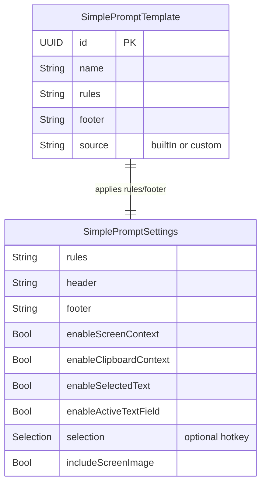

**SimplePromptSettings**: Simplified configuration for the two user-facing modes. Each mode can independently toggle OCR screen context, clipboard history, selected text, and the full active text field payload.
- **Dictation**: Voice-to-text formatting. Fresh installs default to Fn/Globe, screen context on, clipboard context off, selected text off, and active field context on.
- **Command**: Selected-text/OCR aware assistant mode. Fresh installs default to Right Option, screen context on, clipboard context off, selected text off, and active field context on.

**SimplePromptTemplate**: Reusable dictation prompt template. Built-in templates live in code; custom templates persist as JSON data and store the prompt body (`rules`) plus footer.

**SimpleVoiceEngine**: User-facing toggle that selects the transcription backend.

| Case | Description | Underlying Model |
|------|-------------|------------------|
| `parakeet-local` | On-device Parakeet V3 for maximum privacy/latency | `parakeet-local` |
| `groq-streaming` | Groq Whisper Large V3 Turbo over HTTPS chunks | `whisper-large-v3-turbo` (via Groq) |
| `openrouter-transcription` | OpenRouter speech-to-text endpoint for cloud voice models | `openai/gpt-4o-mini-transcribe` by default |
| `xai-stt` | xAI Grok Speech-to-Text over HTTPS multipart upload | `xai-stt` service endpoint |
| `soniox-streaming` | Soniox V5 real-time streaming with live preview | `stt-rt-v5` |

---

## Service Models

### Provider Settings

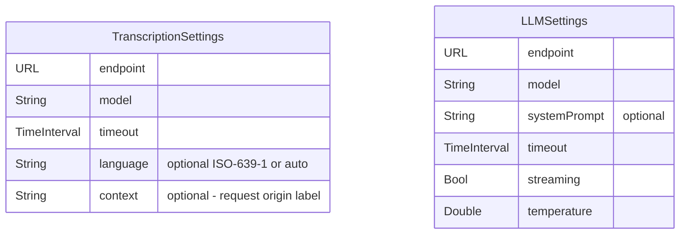

**TranscriptionSettings**: Configuration for speech-to-text providers (Parakeet V3 local capture, Groq Whisper Turbo, OpenRouter speech-to-text, xAI Grok Speech-to-Text, and Soniox streaming)

**LLMSettings**: Configuration for language model providers (OpenRouter only; legacy Cerebras keychain support remains). OpenRouter chat requests explicitly send `reasoning.effort = "none"` and `reasoning.exclude = true` for post-processing and command LLM calls; this is a request default, not a persisted UserDefaults setting.

---

### Hotkey & Input System

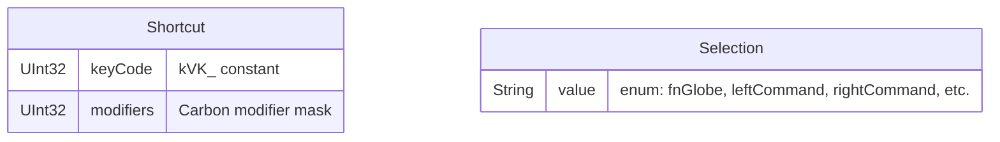

**Shortcut**: Key combination (e.g., Cmd+V) using Carbon API constants

**Selection**: Single modifier key for push-to-talk/toggle recording:
- `.fnGlobe` - Fn/Globe key
- `.leftCommand` - Left ⌘
- `.rightCommand` - Right ⌘
- `.leftOption` - Left ⌥
- `.rightOption` - Right ⌥
- `.control` - Either Control key
- `.commandRightShift` - ⌘ + Right Shift
- `.optionRightShift` - ⌥ + Right Shift
- `.f5` - F5 function key

---

### Mode & Enums

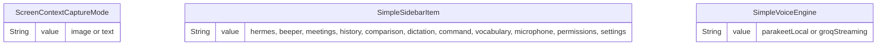

---

## Entity Relationship Diagrams

### Complete System Overview

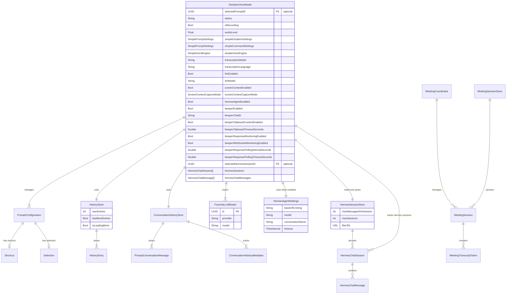

---

## Storage & Persistence

### File System Layout

```
~/Library/Application Support/HermesWhisper/
├── History/
│   ├── entries/           # JSON files (HistoryEntry)
│   │   ├── <uuid>.json
│   │   └── ...
│   ├── audio/             # M4A/WAV recordings
│   │   ├── <uuid>.m4a
│   │   └── ...
│   └── images/            # PNG/JPG screen captures
│       ├── <uuid>.png
│       └── ...
├── ConversationHistory/
│   └── conversations/
│       ├── <promptID>_messages.json    # PromptConversationMessage[]
│       └── <promptID>_metadata.json    # ConversationHistoryMetadata
├── HermesChat/
    ├── sessions.json      # Last retained HermesChatSession[] rows
    └── messages.json      # Legacy flat HermesChatMessage[] rows, migrated on load
└── Meetings/
    └── <uuid>/
        ├── manifest.json          # MeetingSession and MeetingTranscriptToken[]
        ├── manual-notes.md        # Atomically saved user-authored notes
        ├── microphone-0001.caf   # One-minute 16 kHz mono segments
        └── system-0001.caf       # One-minute 16 kHz mono segments
```

### UserDefaults Keys

| Key | Type | Description |
|-----|------|-------------|
| `prompts.library` | Data | JSON-encoded `[PromptConfiguration]` |
| `prompts.selected.id` | String | UUID of selected prompt |
| `transcription.model` | String | Active transcription model |
| `transcription.language` | String | Transcription language code |
| `transcription.timeout` | Double | Network timeout (seconds) |
| `llm.enabled` | Bool | LLM processing enabled |
| `llm.model` | String | Active LLM model |
| `llm.streaming` | Bool | Streaming mode enabled |
| `llm.temperature` | Double | LLM temperature (0.0-1.0) |
| `llm.systemPrompt` | String | Last-selected system prompt text |
| `llm.userMessage` | String | Last-selected user prompt text |
| `llm.openrouter.routing` | String | OpenRouter routing priority (auto/latency/throughput) |
| `screenContext.enabled` | Bool | Screen context capture enabled |
| `screenContext.captureMode` | String | Capture mode (image/text) |
| `screenContext.preprocessMode` | String | Preprocessing mode |
| `screenContext.organizePrompt` | String | Organization prompt |
| `clipboardContext.enabled` | Bool | Clipboard context enabled |
| `vocab.custom` | String | Custom vocabulary list |
| `vocab.spelling` | String | Text replacement rules |
| `audio.input.uid` | String | Selected microphone UID |
| `hotkey.selection` | String | Hotkey selection mode |
| `pasteShortcut.keyCode` | Int | Paste shortcut key code |
| `pasteShortcut.modifiers` | Int | Paste shortcut modifiers |
| `insertion.useAX` | Bool | Use accessibility API for insertion |
| `insertion.pasteFormatted` | Bool | Paste as formatted text |
| `audio.preprocess.enabled` | Bool | Audio preprocessing enabled |
| `audio.voiceProcessing.enabled` | Bool | Voice processing enabled |
| `history.maxEntries` | Int | Maximum history entries to keep |
| `simple.llm.enabled` | Bool | LLM enabled in simple mode |
| `simple.model.selected` | String | Selected OpenRouter model |
| `simple.model.custom` | Array<String> | Custom OpenRouter model IDs |
| `simple.voice.engine` | String | Selected transcription engine (`parakeet-local`, `groq-streaming`, `openrouter-transcription`, `xai-stt`, or `soniox-streaming`) |
| `transcription.openrouter.model` | String | Selected OpenRouter speech-to-text model ID |
| `simple.dictation.settings` | Data | Dictation prompt settings |
| `simple.command.settings` | Data | Command prompt settings |
| `simple.dictation.promptTemplates` | Data | Custom dictation prompt templates |
| `simple.sidebar.selection` | String | Selected sidebar item |
| `meeting.transcription.engine` | String | Meeting transcription engine (`parakeet`, single-stream `soniox`, or fallback `soniox-separate`); defaults to local Parakeet when unset or unknown |
| `meeting.autoDetection.enabled` | Bool | Detect configured meeting applications and start/stop capture automatically; opt-in and false when unset |
| `meeting.autoDetection.triggerRules` | Data | JSON-encoded `MeetingTriggerRule[]` containing bundle prefix, display name, strict Meet/Slack or explicit-microphone mode, and app-scoped capture rule; migrates legacy `meeting.autoDetect.apps` values |
| `meeting.notes.generate` | Bool | Opt in to sending the complete transcript to OpenRouter for Markdown notes after capture; defaults to false |
| `meeting.notes.model` | String | OpenRouter model used for final notes and suggested meeting titles; defaults to `openai/gpt-5.4-nano` |
| `meeting.obsidian.vaultRoot` | String | Obsidian vault root used for local Markdown indexing and live-context links; migrates the root containing the legacy `meeting.obsidian.folder` selection |
| `meeting.obsidian.exportFolder` | String | Optional meeting-summary export folder inside the configured vault; falls back to the vault root and migrates the legacy `meeting.obsidian.folder` selection |
| `meeting.obsidian.folder` | String | Legacy combined vault/export folder key, migrated to the separate vault-root and export-folder settings |
| `meeting.obsidian.autoExport` | Bool | Export completed meetings automatically to the configured export folder, or the vault root when no override is set |
| `meeting.context.enabled` | Bool | Extract useful live subjects, search and rank the local Obsidian vault, and summarize bounded matching excerpts during a meeting |
| `meeting.context.model` | String | Fast OpenRouter model used only for live topic extraction and context briefs; defaults to `openai/gpt-5.4-nano` |
| `meeting.overlay.enabled` | Bool | Show the compact translucent transcript/context companion while recording; defaults to true |
| `meeting.ticketBaseURL` | String | Optional Jira browse base URL for live ticket links; defaults to Hapana Jira |
| `audio.stream.eq.enabled` | Bool | Stream EQ enabled |
| `audio.stream.dynamics.enabled` | Bool | Stream dynamics enabled |
| `audio.stream.chunkMs` | Int | Stream chunk size (ms) |
| `network.http_protocol_preference` | String | HTTP protocol preference |
| `hermes.agent.enabled` | Bool | Enable the dedicated Hermes voice hotkey |
| `hermes.api.baseURL` | String | Hermes API server URL; blank by default, root and `/v1` URLs are both accepted |
| `hermes.conversation.name` | String | Hermes conversation prefix used when creating new sessions |
| `hermes.model` | String | Fallback Hermes API model field when no profile is configured |
| `hermes.profile.name` | String | Optional Hermes API profile/model name; blank uses the server default, nonblank is sent as the request model and verified against `/v1/models` |
| `hermes.timeout` | Double | Hermes request timeout (stored in seconds; settings UI edits whole minutes), default 1,200 seconds, clamped from 15 seconds to 1,800 seconds |
| `hermes.shortcut.selection` | String | Dedicated Hermes activation key; defaults to `backslash` and accepts `backslash`, `f5`, and modifier-key selections |
| `hermes.context.screenText.enabled` | Bool | Include Hermes OCR/screen text context |
| `hermes.context.screenshot.enabled` | Bool | Attach Hermes active-window screenshot images |
| `hermes.context.clipboard.enabled` | Bool | Include Hermes copied text / clipboard context |
| `hermes.context.clipboard.timeoutSeconds` | Double | Hermes copied text freshness timeout; default 20 seconds, clamped from 1 to 600 seconds |
| `hermes.postProcessing.enabled` | Bool | Clean Hermes dictations through the OpenRouter post-processing flow before sending |
| `hermes.chat.maxMessages` | Int | Maximum persisted Hermes chat messages to retain; default 50 |
| `hermes.sessions.maxSessions` | Int | Maximum persisted Hermes sessions to retain; default 25 |
| `beeper.enabled` | Bool | Enable the dedicated Beeper voice-send hotkey |
| `beeper.api.baseURL` | String | Beeper Desktop API base URL; defaults to `http://localhost:23373`, root and `/v1` URLs are both accepted |
| `beeper.chat.id` | String | Target Beeper chat ID for send-only voice messages |
| `beeper.shortcut.selection` | String | Dedicated Beeper activation key; accepts `backslash`, `f5`, and modifier-key selections |
| `beeper.postProcessing.enabled` | Bool | Clean Beeper dictations through the Dictation OpenRouter post-processing flow before sending |
| `beeper.context.clipboard.enabled` | Bool | Attach recently copied text to Beeper voice messages as clipboard context |
| `beeper.context.clipboard.timeoutSeconds` | Double | Beeper copied text freshness timeout; default 20 seconds, clamped from 1 to 600 seconds |
| `beeper.response.monitoring.enabled` | Bool | Watch the configured Beeper chat and show new incoming text replies in response windows |
| `beeper.response.websocket.enabled` | Bool | Try Beeper's experimental WebSocket stream before falling back to polling |
| `beeper.response.polling.intervalSeconds` | Double | Beeper response polling interval; default 10 seconds, clamped from 2 to 60 seconds |
| `beeper.response.polling.timeoutSeconds` | Double | Legacy bounded-response timeout retained for compatibility; default 120 seconds, clamped from 10 to 600 seconds |

### Keychain Storage

Secure storage via `KeychainService` for API keys. WonderWhisper deliberately continues using
the Hermes-era `com.danekapoor.hermeswhisper` service and can also read the original
`com.slumdev88.wonderwhisper.WonderWhisper-Mac` service for one-time migration. Reads fail
without showing macOS authentication UI. If macOS blocks legacy access, keys may need to be
saved once under the compatibility service.

| Key Alias | Purpose |
|-----------|---------|
| `GROQ_API_KEY` | Groq API authentication (Whisper Turbo) |
| `OPENROUTER_API_KEY` | OpenRouter API authentication |
| `XAI_API_KEY` | xAI API authentication (Grok Speech-to-Text) |
| `SONIOX_API_KEY` | Soniox API authentication |
| `HERMES_API_SERVER_KEY` | Hermes API server bearer token |
| `BEEPER_ACCESS_TOKEN` | Beeper Desktop API access token |

---

## UI State Models

### View Models

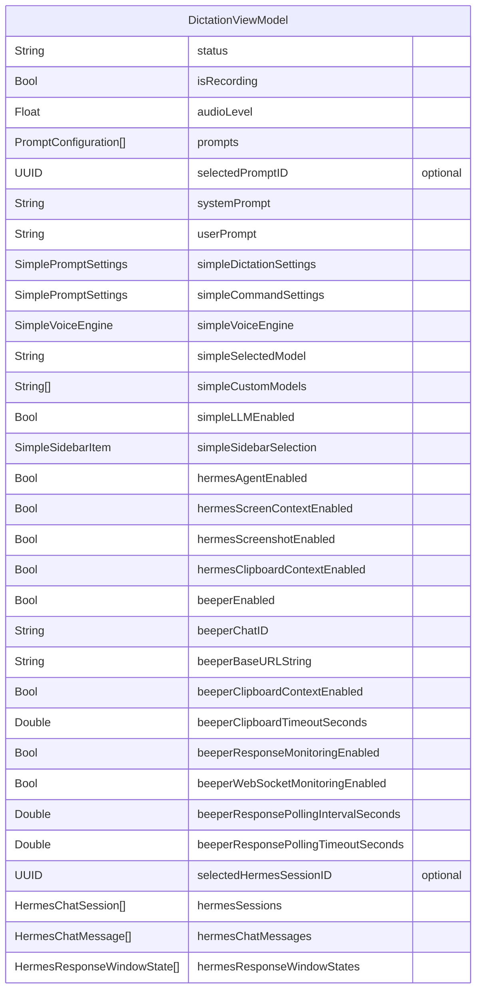

---

## Configuration Models

### Application Configuration

```swift
struct AppConfig {
    // API Endpoints
    static let groqAudioTranscriptions: URL
    static let groqChatCompletions: URL
    static let openrouterChatCompletions: URL
    static let openrouterModels: URL
    
    // Default Models
    static let defaultTranscriptionModel: String = "whisper-large-v3-turbo"
    static let defaultLLMModel: String = "moonshotai/kimi-k2-instruct"
    
    // Default Prompts
    static let defaultSystemPromptTemplate: String
    static let defaultDictationPrompt: String
    static let defaultScreenOrganizePrompt: String
    
    // Keychain Aliases (active)
    static let groqAPIKeyAlias: String = "GROQ_API_KEY"
    static let openrouterAPIKeyAlias: String = "OPENROUTER_API_KEY"
    static let hermesAPIKeyAlias: String = "HERMES_API_SERVER_KEY"
    static let defaultHermesBaseURLString: String = ""
    static let defaultHermesModel: String = "hermes-agent"
    static let defaultHermesConversationName: String = "wonderwhisper-mac"
    static let beeperAccessTokenAlias: String = "BEEPER_ACCESS_TOKEN"
    static let defaultBeeperBaseURLString: String = "http://localhost:23373"
    
    // Network
    static let httpProtocolPreference: HTTPProtocolPreference
}
```

---

## Maintenance

- Update this document whenever you change entities, fields, relationships, storage locations, configuration keys, or persistence formats.
- Record notable breaking changes inline near the affected section.
- After updates: adjust migrations (if applicable), update tests, and verify any storage paths referenced in code and in AGENTS.md.

### Changelog

- **v1.14 (July 12, 2026)**: Added a pre-output Core Audio process tap for route-independent system capture, timestamp-aligned adaptive echo reduction, and one-stream Soniox meeting transcription with speaker labels, while preserving two raw CAF tracks and a source-separated fallback.
- **v1.13 (July 11, 2026)**: Added durable user-authored manual meeting notes in the companion, final-note evidence, meeting history, and Obsidian exports.
- **v1.12 (July 11, 2026)**: Added Dia helper attribution, fast two-observation starts with dropout-tolerant active-call liveness and same-call suppression, opt-in dual-stream Soniox V5 meeting transcription with transient non-final captions and background finalization, rate-limited subject-aware live Obsidian retrieval with batched briefs and explicit index errors, and configurable Jira or Hapana Linear ticket links.
- **v1.11 (July 10, 2026)**: Added durable meeting sessions, dual system/microphone audio segments, source-tagged streaming Parakeet Unified tokens, automatic Slack/Google Meet detection, generated notes, Obsidian export, and optional live vault context.
- **v1.10 (June 1, 2026)**: Made Beeper response monitoring ambient for the configured chat and aligned response-window text replies with immediate focus, Return-to-send, and Shift-Return newline behavior.
- **v1.9 (May 31, 2026)**: Added Beeper voice integration settings, chat ID storage, shortcut selection, keychain token alias, copied-text context, bounded response polling, and experimental WebSocket-first monitoring.
- **v1.8.2 (May 19, 2026)**: Added reusable dictation prompt templates with custom template persistence.
- **v1.8.1 (May 19, 2026)**: Added `permissions` to `SimpleSidebarItem` for the macOS permissions checker tab.
- **v1.8 (May 8, 2026)**: Added Hermes LLM title generation, optional Hermes post-processing, clearer response-window focus/reply state, selectable message bodies, and raw/formatted copy actions.
- **v1.7 (May 7, 2026)**: Limited Hermes clipboard context to copied text captured within one minute before recording start.
- **v1.6 (May 7, 2026)**: Added persistent multi-session Hermes storage and per-session response windows.
- **v1.5 (May 7, 2026)**: Documented OpenRouter chat requests disabling reasoning by default.
- **v1.4 (May 6, 2026)**: Added persistent Hermes chat history storage capped to the latest 50 messages by default.
- **v1.3 (May 6, 2026)**: Raised the Hermes request timeout maximum from 600 to 1,800 seconds.
- **v1.2 (May 6, 2026)**: Added `HermesChatMessage` as the current-session Hermes chat UI model and documented Hermes as a first-class sidebar item.
- **v1.1 (Nov 14, 2025)**: Removed non-existent `ScreenContextPreprocessingMode`, added vocabulary & microphone to `SimpleSidebarItem`, clarified legacy keychain aliases, updated LLM provider documentation to reflect OpenRouter-only architecture.

### Simple Mode Defaults

```swift
enum SimpleModeDefaults {
    static let defaultModelID = "moonshotai/kimi-k2-0905"
    
    // Predefined model options
    static let modelOptions: [SimpleModelOption] = [
        // Moonshot, Meta LLaMA, OpenAI, Google Gemini, Anthropic Claude, Mistral
    ]
    
    // Default rules for dictation mode (17 rules)
    // Default rules for command mode (16 rules)
}
```

---

## Data Flow Diagrams

### Dictation Flow

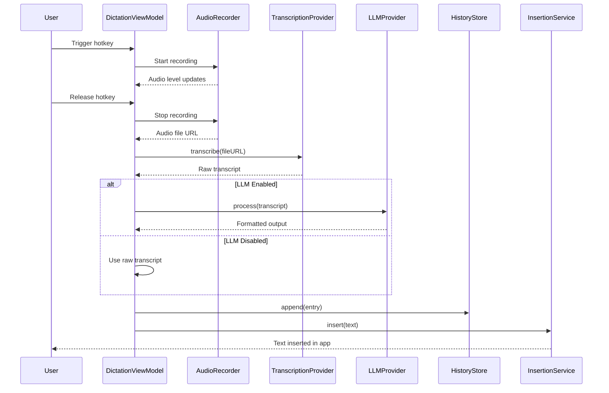

### Conversation Mode Flow

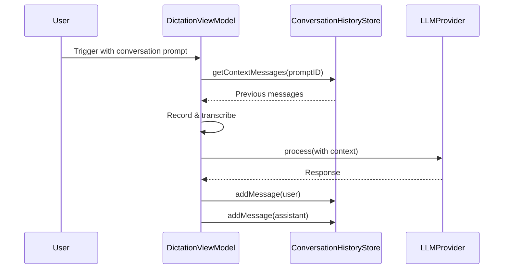

### Hermes Voice Flow

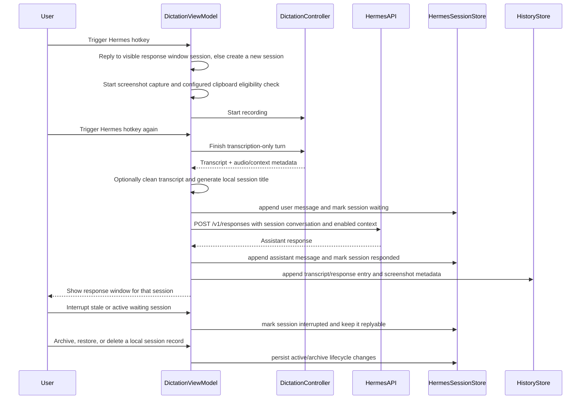

---

## Key Design Patterns

### 1. Provider Cache Pattern
- `DictationViewModel` maintains provider caches to avoid recreating HTTP clients
- Providers are keyed by configuration signature and keyed separately for streaming/file modes
- Cache invalidation on settings change

### 2. Debounced Updates
- Provider updates debounced (500ms) to prevent excessive recreation
- Navigation should not trigger provider updates (performance optimization)

### 3. File-Based Persistence
- History entries stored as individual JSON files
- Paginated loading (20 entries at a time)
- Background queue for I/O operations

### 4. Conversation History Isolation
- Each prompt maintains separate conversation history
- Provider changes clear history automatically
- Configurable context window (message count)

### 5. Simple/Pro Mode Abstraction
- Simple mode generates `PromptConfiguration` internally
- Settings persisted separately but rendered as prompts
- Seamless switching preserves pro settings

---

## Migration Notes

### Legacy Compatibility

- `organizeScreenContextOverride` (Bool) field removed; legacy key ignored during decoding
- `shortcut` field in `SimplePromptSettings` ignored during decoding (simple mode uses `selection` only)
- Conversation history tracks provider changes to handle model switches
- Legacy Cerebras, Ollama, and AssemblyAI keychain aliases are preserved but unused. The active
  `SONIOX_API_KEY` alias is used by dictation and the opt-in Soniox meeting beta.

---

## Performance Considerations

### History Store
- **Pagination**: Load 20 entries at a time to avoid blocking UI
- **Background I/O**: All file operations on background queue
- **Lazy metadata**: File dates fetched only when needed

### Provider Management
- **Cache warmth**: HTTP connections pre-warmed on init
- **Debouncing**: 500ms debounce on settings changes
- **Lazy initialization**: Providers created only when needed

### Conversation History
- **Bounded context**: Limit to N most recent messages
- **Auto-cleanup**: Clear on provider/model change
- **Async writes**: All I/O operations asynchronous

---

## Security & Privacy

### API Key Management
- All API keys stored in macOS Keychain
- Never persisted to UserDefaults or JSON
- Retrieved on-demand via `KeychainService`

### Audio & Screen Captures
- Stored locally in Application Support directory
- No cloud sync or external transmission
- User controls retention via `maxEntries` setting

### Prompt Library
- User-created prompts stored locally
- System prompts embedded in app bundle
- No telemetry or external sharing

---

## Future Considerations

### Potential Schema Extensions

1. **Tags/Categories for Prompts**
   - Add `tags: [String]` to `PromptConfiguration`
   - Enable filtering and organization

2. **Multi-Language Vocabulary**
   - Extend vocabulary storage per language
   - Support language-specific custom dictionaries

3. **Prompt Sharing/Import**
   - Export prompt as JSON
   - Import community-created prompts

4. **Advanced History Filtering**
   - Filter by app, model, date range
   - Full-text search across transcripts

5. **Cloud Sync (Optional)**
   - CloudKit integration for prompt library
   - End-to-end encrypted conversation history

---

## API Contract Summary

### Core Protocols

```swift
protocol TranscriptionProvider {
    func transcribe(fileURL: URL, settings: TranscriptionSettings) async throws -> String
}

protocol LLMProvider {
    func process(text: String, userPrompt: String, settings: LLMSettings) async throws -> String
}
```

### Provider Implementations

- **TranscriptionProvider**:
  - `GroqTranscriptionProvider` (Groq Whisper API - batch)
  - `GroqStreamingProvider` (Groq chunked streaming)
  - `OpenRouterTranscriptionProvider` (OpenRouter speech-to-text JSON API)
  - `XAITranscriptionProvider` (xAI Grok Speech-to-Text REST API)
  - `ParakeetTranscriptionProvider` (local V3 on-device)
  - `SonioxStreamingProvider` (Soniox V5 real-time streaming)

- **LLMProvider**:
  - `OpenRouterLLMProvider` (OpenRouter multiplexed models)

---

## Glossary

| Term | Definition |
|------|------------|
| **Prompt Configuration** | Template defining how voice input is processed and formatted |
| **Conversation Mode** | Stateful interaction maintaining context across multiple dictations |
| **Screen Context** | Information about active application and on-screen content |
| **Simple Mode** | Primary UI with Dictate and Command presets |
| **Push-to-Talk** | Hold hotkey to record, release to process |
| **Toggle Mode** | Tap hotkey to start/stop recording |
| **Provider** | External or local service for transcription or LLM processing |

---

**Document Version**: 1.15
**Last Updated**: July 12, 2026
**Maintainer**: WonderWhisper Development Team
